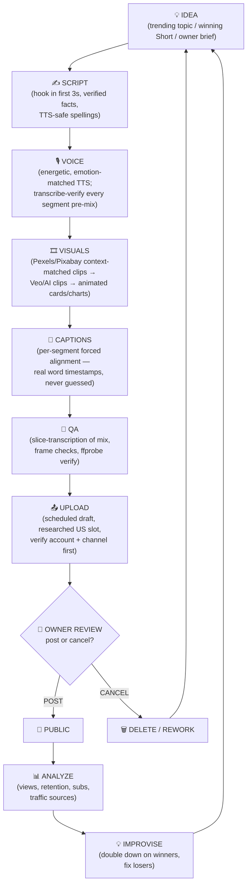

# 🔁 Workflow — Video Production Pipeline

> Last updated: 2026-10-01 (NPT)

## Diagram

## Stage descriptions

| Stage | What happens | Key checks |
|---|---|---|
| 💡 Idea | Trending topic, winning-Short blueprint (Dark Files), or owner brief. Kids: rhyme written here and **owner-verified before anything else**. | Is it US-audience relevant? Is it in-channel niche? |
| ✍️ Script | Hook in first 3 seconds. Facts verified against sources (2026-current). TTS-safe spellings ("Tee Rex"). Medical disclaimer for BodyTruth. | No copied lyrics/melodies. Claims hedged where science is debated. |
| 🎙️ Voice | Energetic, exciting, emotion-matched TTS (never flat/sad). Transcribe every segment pre-mix. | No silent truncation. Pace calibrated to perception, not math. |
| 🎞️ Visuals | 1) Pexels/Pixabay clips cut to narration context → 2) Veo/AI clips for gaps → 3) animated cards, charts, stat pops. Film grain for Dark Files. | Every clip matches the narration moment. No "deadly" generic footage. |
| 💬 Captions | Per-segment forced alignment (faster-whisper on clean TTS). Karaoke highlighting. ≥500px above bottom. | Monotonic timestamps. No overlaps with cards. |
| 🧪 QA | Slice-transcribe the actual mix (all sentences once, in order). Frame checks: hook/mid/end. ffprobe verify. Thumbnail safe-zone previews. | Mix integrity, caption legibility, thumbnail TV-safe. |
| 📤 Upload | As **scheduled** draft at a researched US-optimal slot. Verify `krishna.dhakal03@gmail.com` + correct channel first. Compress to <100MB. | Audience, altered-content, playlist, thumbnail, copyright checks clean. |
| 👀 Review | Owner watches and gives per-video **post or cancel**. | — |
| 📊 Analyze | 24h/48h/7d pulls: views, AVD, % stayed, likes, subs, traffic sources. | Log to `stats/YYYY-MM-DD.md`. |
| 💡 Improvise | Winners get sequels and formula reuse; losers get diagnosed. | Update channel strategy notes. |

## Environment lessons (the box we render on)

- No GPU: keep Remotion compositions light; render muted JPEG chunks with
  `TMPDIR=~/workspace/tmp_remotion --concurrency=1`, concat after.
- One render at a time: check `~/workspace/.render_lock` before starting.
- Long background ffmpeg encodes die silently ~2–3 min in: use `-preset veryfast`
  or run in foreground with generous yield.
- `/tmp` is wiped on restart: all intermediates go under `~/workspace`.
